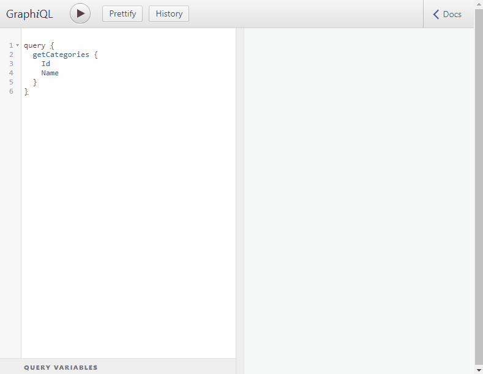

# TL;DR;
Start containers with compose file in folder "docker":
```
docker-compose up
```
Access graphiql via your browser:
```text
http://localhost:8080
```

# Getting Started
### Description
This project is a boilerplate for using plain Hibernate 5 with GraphQL webservice in spring boot.
It uses a docker container with mariadb as database backend for testing.

Based on:
 - Hibernate 5
 - Spring Boot
 - GraphQL Spring Boot starter

### Prerequisites
Installed docker daemon on local system.

### Backend
The backend spring boot application runs inside a openjdk container.

### Database
The database for this project runs inside a docker container. You can have a look on the schema in [initial sql script](docker/init.sql) file.

### Starting Docker container
**Do not run this container in a production enviroment!**

Run ` docker-compose up` and don't forget to delete the container after you finished: `docker-compose rm` and `docker rmi -f docker_graphql_backend`.

For Linux just run the following:

```
docker-compose up && docker-compose rm && docker rmi -f docker_graphql_backend
```

### GraphQL - Examples
You can access GraphiQL testconsole from:

```text
http://localhost:8080/graphiql/
```

In the graphql schema-file ([schema.graphqls](src/main/resources/schema.graphqls)) you can see what functions are available via graphQL

#### Query

Example (get all categories with links).


Example 2 (get all links with category):

```text
query {
  getLinks {
  	Name
    Url 
    Category {
      Name
    }
  }
}
```

#### Mutation 
##### Insert

Example (add a new link).
This query returns the saved link if everything works correctly.

```text
mutation {
  addLink(
    Name:"NewLink"
    Url:"https://myURL.com"
    CategoryId:3
  ) {
    Name,
    Id
  }
}
```

##### Update

Example (update the name of a link based on the id).
This query returns the modified link if everything works correctly.

```
mutation {
  updateLink(
    Id:1
    Name:"New Website Name"
  ) {
    Name
    Id
  }
}
```
